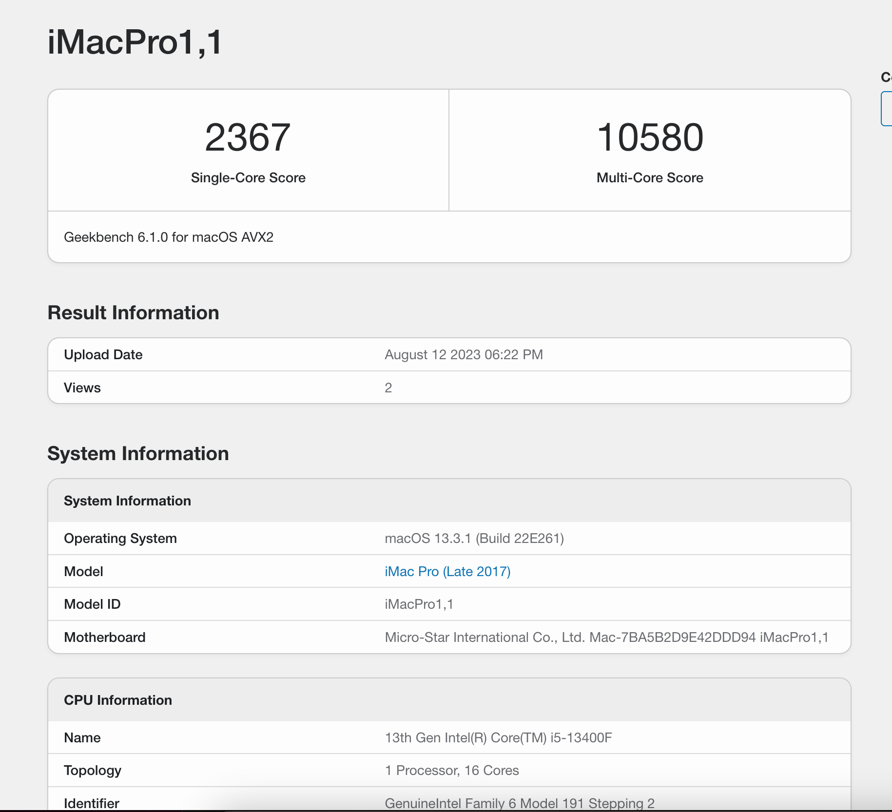
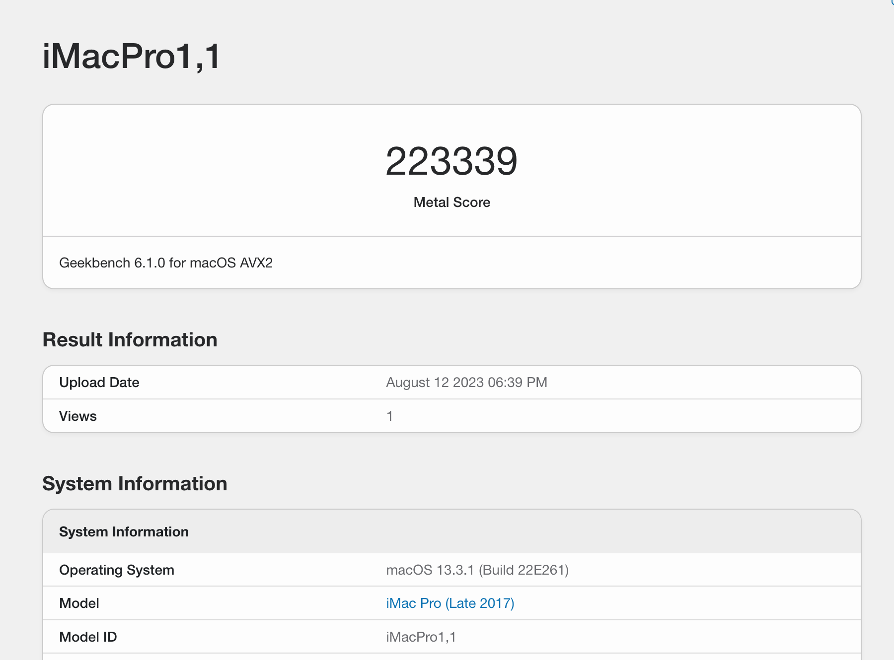
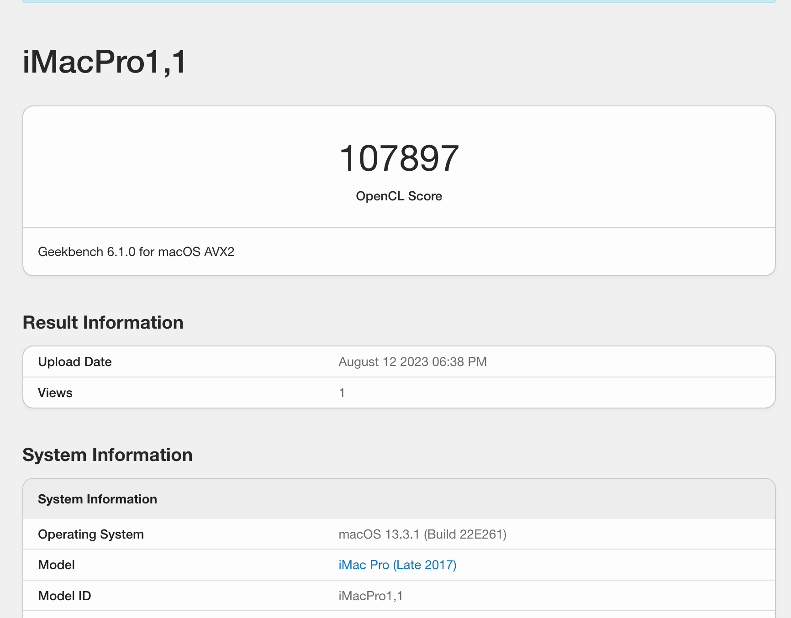

# [MSI-MAG-B760M-MORTAR-WIFI-DDR4](https://www.msi.com/Motherboard/MAG-B760M-MORTAR-WIFI-DDR4) Hackintosh OpenCore EFI

### OpenCore

[OpenCore 0.9.3](https://github.com/acidanthera/OpenCorePkg)

### OS Version Tested

- macOS Ventura 13.3.1

### Hardware

- Motherboard: MSI-MAG-B760M-MORTAR-WIFI-DDR4
- CPU: Intel i5-13400F
- RAM: CORSAIR Dominator 4x8 DDR4 3200MHz
- SSD: MSI SPATIUM M450 1TB M2 2280 NVMe (Hackintosh)
- SSD: Kingston NV2 500GB NVMe (Windows)
- GPU: AMD Radeon™ RX 6800 XTPhantom Gaming 16GB OC
- Audio: Realtek ALC256
- Ethernet: Realtek 8125
- Wireless: Intel Wi-Fi 6E AX211 (Windows)
- Bluetooth + Wireless: BCM94360CD (Hackintosh)
- Display:LG 27QN600 27 inch + LG 24QP500 24 inch
- PSU: COOLERMASTER V850 SFX GOLD
- CASE: CASE LIAN-LI PC - O11-DYNAMIC 

### Bios Setup

| Name        | Option   |
|-------------|----------|
| Secure Boot | Disabled |
| CFG Lock    | Disabled |
| Fast Boot   | Disabled |

### Notes

- Use [OpenCore Configurator](https://mackie100projects.altervista.org/opencore-configurator/) build your SMBIOS

### ScreenShot

- Geekbench5 Score i5-13400F

- Geekbench5 Score Metal AMD Radeon™ RX 6800 XTPhantom Gaming 16GB OC

- Geekbench5 Score OpenCL AMD Radeon™ RX 6800 XTPhantom Gaming 16GB OC

